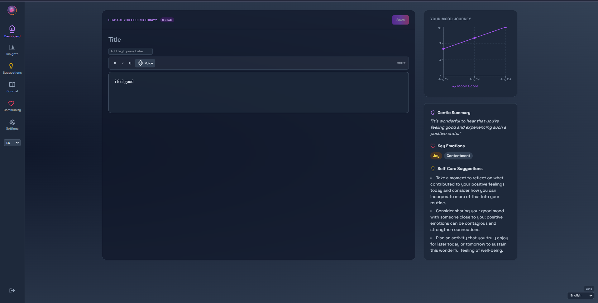
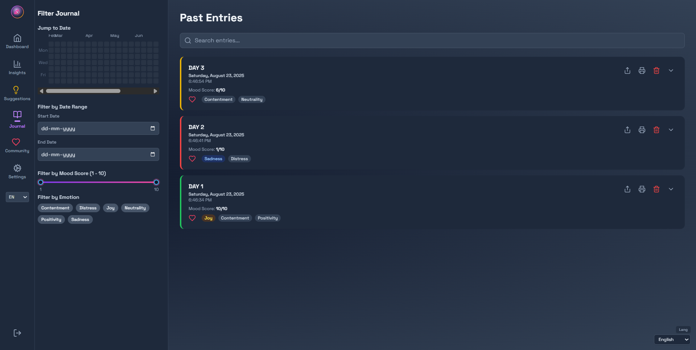
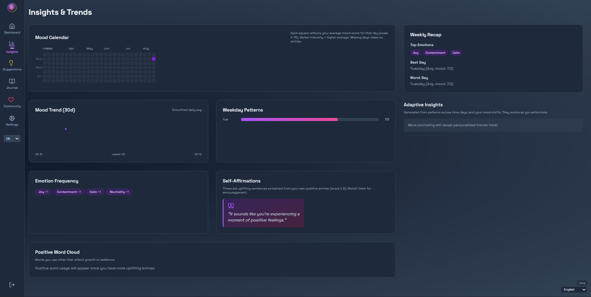
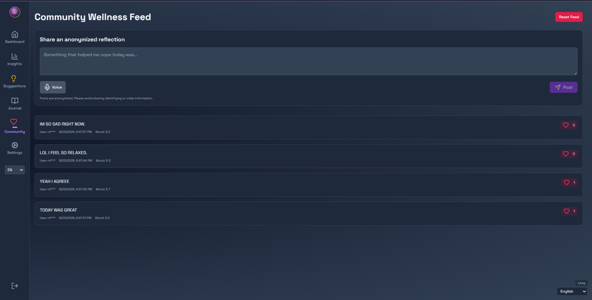
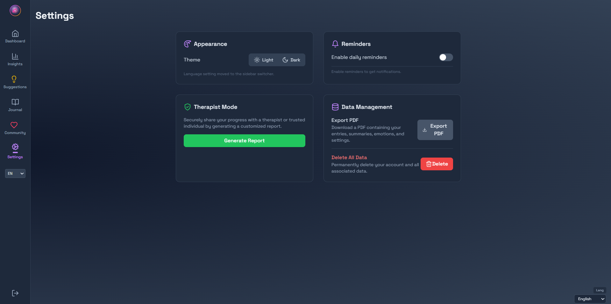

<div align="center">

# Aura – AI Diary & Emotional Insights

Futuristic, privacy‑minded journaling. Type or speak entries, get instant emotional + sentiment insights, track mood trends, and receive gentle, personalized self‑care suggestions.

## 📸 App Previews
Below are screenshots of key pages. Images are located in the `Pics` folder and named after their respective pages:

| Home | Dashboard | Journal | Insights | Community Feed | Settings | Sign In | Sign Up |
|------|-----------|---------|----------|----------------|----------|---------|---------|
| .png) |  |  |  |  |  |  |  |

</div>

## ✨ Core Features
* Rich Text + Voice: Lexical editor with formatting (bold / italic / underline) and live speech‑to‑text (Web Speech API). 
* AI Emotional Analysis: Gemini-powered insight & recommendations layer (pluggable abstraction in `frontend/services/geminiService.ts`).
* Mood Intelligence: Calendar heatmap + charts (Recharts + d3-scale) to visualize sentiment over time.
* Titles & Tags: Organize entries with quick searchable metadata (title, tags pipeline persisted via backend).
* Therapist Mode: Generate anonymized shareable summaries / PDF (`utils/pdfGenerator.ts`).
* Community Feed (Optional): Anonymous sharing with on‑the‑fly sentiment scoring (classic sentiment lib) + admin purge route.
* Offline Resilience: Local queue / caching logic (IndexedDB) to avoid data loss while offline.
* Data Control: Export or delete all personal data (user endpoints) + secure purge key for community moderation.
* Aesthetic Layer: Plasma gradients, noise overlays, neon glows, motion (Framer Motion) for an ambient UI.
* Accessibility & Safety: Rate limiting, sanitization, CSP, Helmet, input size limits.

## 🛠️ Tech Stack
Frontend: React 19 · Vite · TypeScript · Tailwind CSS · Lexical · Framer Motion · Recharts · i18next
Backend: Node.js · Express · MongoDB · Mongoose
AI: Gemini API (@google/genai)
Security: Helmet, express-rate-limit, express-mongo-sanitize, xss-clean, JWT auth
Voice: Web Speech API (secure context required – HTTPS or localhost)

## 📁 Structure
```
backend/
  src/
    server.js
    controllers/
    middleware/
    models/
    routes/
frontend/
  components/
  pages/
  hooks/
  services/
  utils/
  context/
```

## 🤖 Model Folder

The `model` directory contains assets for advanced emotion and sentiment analysis:

- `distilbert_models.ipynb`: Jupyter notebook that trains a multi-label emotion classification model using DistilBERT (HuggingFace Transformers, PyTorch). It processes journal entries, tokenizes them, and predicts multiple emotions per entry. The model uses BCEWithLogitsLoss and AdamW optimizer, and is evaluated with F1 score and classification metrics. The notebook demonstrates data cleaning, training, and evaluation workflows for robust emotion detection.

- `best_model.pt`: The best performing PyTorch model checkpoint from the notebook, suitable for advanced sentiment and emotion analysis. While not directly integrated into the app yet, it can be used to power richer insights and emotion detection features in future updates.

- `emotion_classification_model_complete.pt`: A finalized version of the emotion classification model, ready for deployment or further experimentation.

These models enable nuanced emotion analysis beyond basic sentiment scoring, and can be integrated into backend or AI services to provide deeper emotional insights for diary entries.

## 🔐 Environment Variables (Backend `.env`)
Required:
```
MONGO_URI=mongodb+srv://...
JWT_SECRET=supersecretlongrandom
GEMINI_API_KEY=your_gemini_key_here
ALLOWED_ORIGINS=https://yourfrontend.app,https://staging.app (optional, comma separated)
COMMUNITY_PURGE_KEY=some-long-random-admin-key
PORT=5000            # optional
NODE_ENV=development # or production
```

Frontend (optional `.env` in `frontend/` if you proxy or need Vite vars):
```
VITE_API_BASE=http://localhost:5000
VITE_GEMINI_MODEL=gemini-1.5-flash
```

## 🚀 Local Development
```bash
git clone https://github.com/NikhilKartha5/ai-journal.git
cd ai-journal

# Backend
cd backend
npm install
cp .env.example .env  # (create and fill if example provided; otherwise create manually)
npm run dev            # nodemon

# In a second terminal – Frontend
cd ../frontend
npm install
npm run dev
```
Open: http://localhost:5173

### HTTPS & Microphone
Browser speech recognition requires a secure context. localhost / 127.0.0.1 / ::1 count as secure. For LAN / public testing, use HTTPS (self-signed cert or a reverse proxy like Caddy / nginx / vite preview behind mkcert). 

## 🧪 Basic Verification Checklist
* Backend starts, logs MongoDB connected.
* Register → Login → Create diary entry with title + tags.
* Start mic, dictate text, formatting works.
* Entry saved and appears in mood charts.
* Community feed loads; purge (admin only) works when sending `x-purge-key` header.

## 🔄 API Overview (Brief)
| Endpoint | Method | Purpose |
|----------|--------|---------|
| /api/auth/register | POST | Create user |
| /api/auth/login | POST | Authenticate (receives JWT) |
| /api/diary | GET/POST | List / create diary entries |
| /api/diary/:id | PUT/DELETE | Update or delete entry |
| /api/community | GET/POST | Feed list / create post |
| /api/community | DELETE | Purge all posts (requires `x-purge-key`) |
| /api/user/export | GET | Download user data |
| /api/user/delete | DELETE | Delete account + data |

JWT is sent via `Authorization: Bearer <token>` header.

## 🛡️ Security Notes
* CORS restricted via `ALLOWED_ORIGINS`.
* Rate limiting on auth routes (50 / 15 min window default).
* Helmet + custom Content-Security-Policy.
* Mongo & XSS sanitization middleware.
* Short JSON body size limit (64kb) for safety.
* Purge key: Treat `COMMUNITY_PURGE_KEY` like a secret (rotate periodically).

## 📊 Data & Sentiment
* Diary sentiment & mood trends aggregate simple sentiment scoring now; can be upgraded to more nuanced emotion classification.
* Rich text currently stored with plain text content for analysis (extend to persist Lexical JSON if needed).

## 🧱 Deployment Tips
1. Build frontend: `npm run build` inside `frontend` (outputs `dist/`).
2. Serve static (optionally) from a CDN or separate host; point `VITE_API_BASE` to backend URL.
3. Provision MongoDB (Atlas or managed instance).
4. Set all env vars on server/platform (Render, Railway, Fly.io, Docker, etc.).
5. Run backend with a process manager (PM2 / systemd / platform runtime) `node src/server.js`.
6. Enable HTTPS: platform certs or reverse proxy (Caddy / Nginx / Cloudflare) to preserve mic functionality.


## 🧩 Roadmap (Ideas)
* Persist full rich text (Lexical JSON) + advanced formatting (lists, headings).
* Tag & title search / filtering UI enhancements.
* Emotion classification with fine‑tuned model.
* Role-based admin instead of purge key.
* Mobile PWA install + offline sync improvements.

## 🤝 Contributing
Issues & PRs welcome. Please describe context / intention; keep commits focused.

## 📄 License
MIT – see `LICENSE` file for full text.

## 👤 Author
Nikhil N Kartha

---
Feel free to fork and tailor Aura to your own wellness workflow.

